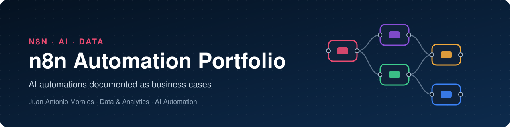

<p align="center">
  
</p>

<p align="center">
  <a href="LICENSE"></a>
  
  
  
  
  
</p>

<p align="center">
  <a href="README.md">Português</a> · <b>English</b>
</p>

---

## 👋 About this repository

This is my portfolio of automations built on **self-hosted n8n**. Each folder is a complete case: the business problem, the one-sentence solution, the architecture, the integrations, the result and the workflow ready to import.

As a Data Project Manager, I bring to automation the same lens I used leading Data & Analytics in multi-market environments: I start from the process and the data, design the flow with clear control points, and document every decision so someone else can operate, audit and evolve the solution.

---

## 🚀 Cases

<table>
  <tr>
    <td width="50%" valign="top">
      <a href="spanish-class-automation/README.en.md">
        
      </a>
      <h3>📚 Daily Exercises · Spanish A1</h3>
      <p>From the week's lesson to 9 AI-generated exercises, approved by the teacher in a spreadsheet and delivered one per day to the class WhatsApp group, with a web challenge, narrated audio and anonymous answer logging.</p>
      <p><b>4 workflows · 39 nodes · in use since Aug 2026</b></p>
      <p>
        
        
        
        
        
      </p>
      <p><a href="spanish-class-automation/README.en.md"><b>Read the case →</b></a> &nbsp;·&nbsp; <a href="spanish-class-automation/README.md">Português</a> &nbsp;·&nbsp; <a href="spanish-class-automation/workflows/">JSON</a></p>
    </td>
    <td width="50%" valign="top">
      <a href="ugc-video-factory/README.en.md">
        
      </a>
      <h3>🎬 UGC Video Factory</h3>
      <p>A photo and a caption on Telegram become an 8-second vertical UGC-style video with a spoken line in Portuguese: visual analysis, prompt agents, and image and video generation through async queues.</p>
      <p><b>1 workflow · 22 nodes · training project</b></p>
      <p>
        
        
        
        
      </p>
      <p><a href="ugc-video-factory/README.en.md"><b>Read the case →</b></a> &nbsp;·&nbsp; <a href="ugc-video-factory/README.md">Português</a> &nbsp;·&nbsp; <a href="ugc-video-factory/workflows/">JSON</a></p>
    </td>
  </tr>
</table>

---

## 🧭 What these cases demonstrate

| Skill | Where it shows |
|---|---|
| **Human-in-the-loop AI** | AI generates the week and the teacher approves it in the spreadsheet; delivery picks up only approved rows · *Spanish* |
| **Prompt engineering** | Explicit rules, counter-examples, JSON output and Structured Output Parser · *Spanish, UGC* |
| **Multimodal orchestration** | Vision, text, image, video and audio in the same flow · *UGC, Spanish* |
| **API integration** | Google Drive and Sheets, WhatsApp, Telegram, GitHub, ElevenLabs and Fal.ai · *both* |
| **Async patterns** | Queue → status check → fetch result, with controlled waits · *UGC, Spanish* |
| **Privacy-aware data** | Anonymous answers become a per-question, per-week accuracy base · *Spanish* |
| **Operations** | Retries, explicit timezone, a global pause switch and WhatsApp error alerts · *Spanish* |
| **Governance and documentation** | Sanitized JSON, sanitization log, diagrams generated from the connections · *both* |

---

## 🛠️ Stack

[](https://n8n.io)
[](https://openai.com)
[](https://workspace.google.com/products/sheets/)
[](https://workspace.google.com/products/drive/)
[](https://github.com/EvolutionAPI/evolution-api)
[](https://core.telegram.org/bots)
[](https://elevenlabs.io)
[](https://fal.ai)
[](https://pages.github.com)
[](https://developer.mozilla.org/docs/Web/JavaScript)
[](https://mermaid.js.org)

---

## 🗂️ Structure

```
n8n-automation-portfolio/
├── README.md · README.en.md        ← this showcase
├── LICENSE                         ← MIT
├── assets/                         ← repository banner
│
├── spanish-class-automation/       ← one case per folder
│   ├── README.md · README.en.md    ← full case in PT and EN
│   ├── workflows/                  ← sanitized JSON, ready to import
│   └── docs/
│       ├── canvas-*.png            ← n8n canvas screenshots
│       ├── diagramas/              ← Mermaid diagrams (.mmd + .png)
│       └── diagramas-workflows.md  ← node-level diagram of each workflow
│
└── ugc-video-factory/              ← same structure
```

---

## ⚡ How to import a workflow

1. In n8n, open **Workflows → Import from File** and pick the JSON from the case's `workflows/` folder.
2. Create the credentials listed in the case README and select each one in the matching nodes.
3. Replace the `YOUR_…` placeholders with your own values (spreadsheet, domain, phone number, repository).
4. Activate the workflow.

Each case README lists every credential, placeholder, community node and the activation order.

---

## 🔒 Publishing standard

Every workflow goes through the same treatment before it lands here:

- **Credentials** with generic names and placeholder IDs, ready for you to attach your own.
- **Instance identifiers** removed: `id`, `versionId`, `meta.instanceId`, `pinData` and error workflow.
- **`YOUR_…` placeholders** for domain, webhook paths, spreadsheet and Drive IDs, phone numbers and repositories.
- **Regenerated webhookIds**, so each import creates its own URLs.
- **Diagrams generated from the JSON `connections` block**, so they mirror the workflow exactly.

---

## 📄 License

Released under the [MIT](LICENSE) license: use, adapt and distribute freely, keeping the copyright notice.

---

## 👤 Author

**Juan Antonio Morales**  
Data Project Manager | Data & Analytics · BI · Portfolio Management | Squad Leadership & LATAM Rollout | Databricks · Power BI · Generative AI

I led the Data & Analytics agenda for Arcos Dorados' (McDonald's) Latin American operations, heading cross-functional squads across C-level sponsored programs with rollout in up to 12 markets. Highlights include the Segment P&L across 12 markets, cutting manual processes by 63%, and the Meu Méqui loyalty program, from pilot to rollout across 11 markets.

Today I apply the same logic to Generative AI, building AI agents and automations that run in production at [Kailor](https://kailor.com.br), while pursuing an MBA in Project Management at FGV.

[](https://www.linkedin.com/in/juanantoniomorales)
[](https://github.com/juanidives)
[](mailto:juan.morales@outlook.com.br)

---

<p align="center">
  <sub>Built in São Paulo with n8n, data and curiosity · Argentina and Brazil always at heart</sub>
</p>
