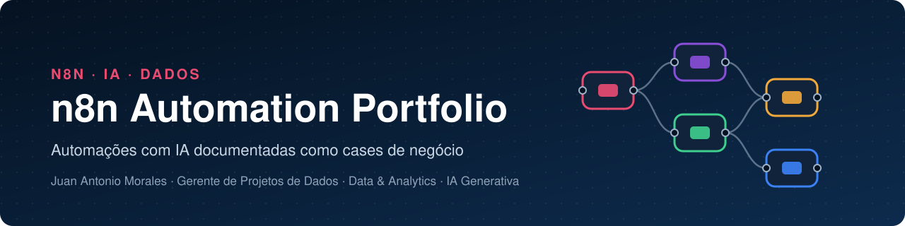

<p align="center">
  
</p>

<p align="center">
  <a href="LICENSE"></a>
  
  
  
  
  
</p>

<p align="center">
  <b>Português</b> · <a href="README.en.md">English</a>
</p>

---

## 👋 Sobre este repositório

Este é o meu portfólio de automações em **n8n self-hosted**. Cada pasta é um case completo: o problema de negócio, a solução em uma frase, a arquitetura, as integrações, o resultado e o workflow pronto para importar.

Venho de 14 anos em BI e gestão de projetos de dados, e trago essa lente para a automação: começo pelo processo e pelo dado, desenho o fluxo com pontos de controle claros e documento cada decisão para que outra pessoa consiga operar, auditar e evoluir a solução.

---

## 🚀 Cases

<table>
  <tr>
    <td width="50%" valign="top">
      <a href="spanish-class-automation/README.md">
        
      </a>
      <h3>📚 Exercícios diários · Espanhol A1</h3>
      <p>Da aula da semana a 9 exercícios gerados com IA, aprovados pelo professor numa planilha e entregues um por dia no WhatsApp da turma, com desafio web, áudio narrado e registro anônimo das respostas.</p>
      <p><b>4 workflows · 39 nós · em uso desde ago/2026</b></p>
      <p>
        
        
        
        
        
      </p>
      <p><a href="spanish-class-automation/README.md"><b>Ler o case →</b></a> &nbsp;·&nbsp; <a href="spanish-class-automation/README.en.md">English</a> &nbsp;·&nbsp; <a href="spanish-class-automation/workflows/">JSON</a></p>
    </td>
    <td width="50%" valign="top">
      <a href="ugc-video-factory/README.md">
        
      </a>
      <h3>🎬 UGC Video Factory</h3>
      <p>Uma foto e uma legenda no Telegram viram um vídeo vertical de 8 segundos no estilo UGC, com fala em português: análise visual, agentes de prompt e geração de imagem e vídeo em filas assíncronas.</p>
      <p><b>1 workflow · 22 nós · projeto de formação</b></p>
      <p>
        
        
        
        
      </p>
      <p><a href="ugc-video-factory/README.md"><b>Ler o case →</b></a> &nbsp;·&nbsp; <a href="ugc-video-factory/README.en.md">English</a> &nbsp;·&nbsp; <a href="ugc-video-factory/workflows/">JSON</a></p>
    </td>
  </tr>
</table>

---

## 🧭 O que estes cases demonstram

| Competência | Onde aparece |
|---|---|
| **IA com humano no circuito** | A IA gera a semana e o professor aprova na planilha; o envio considera apenas o que foi aprovado · *Espanhol* |
| **Engenharia de prompt** | Regras explícitas, contraexemplos, saída em JSON e Structured Output Parser · *Espanhol, UGC* |
| **Orquestração multimodal** | Visão computacional, texto, imagem, vídeo e áudio no mesmo fluxo · *UGC, Espanhol* |
| **Integração com APIs** | Google Drive e Sheets, WhatsApp, Telegram, GitHub, ElevenLabs e Fal.ai · *ambos* |
| **Padrões assíncronos** | Fila → consulta de status → busca do resultado, com espera controlada · *UGC, Espanhol* |
| **Dados com privacidade** | Respostas anônimas viram base de acertos por pergunta e por semana · *Espanhol* |
| **Operação** | Retentativas, fuso horário explícito, chave geral de pausa e alerta de erro no WhatsApp · *Espanhol* |
| **Governança e documentação** | JSON sanitizado, log de sanitização, diagramas gerados a partir das conexões · *ambos* |

---

## 🛠️ Stack

[](https://n8n.io)
[](https://openai.com)
[](https://workspace.google.com/products/sheets/)
[](https://workspace.google.com/products/drive/)
[](https://github.com/EvolutionAPI/evolution-api)
[](https://core.telegram.org/bots)
[](https://elevenlabs.io)
[](https://fal.ai)
[](https://pages.github.com)
[](https://developer.mozilla.org/docs/Web/JavaScript)
[](https://mermaid.js.org)

---

## 🗂️ Estrutura

```
n8n-automation-portfolio/
├── README.md · README.en.md        ← esta vitrine
├── LICENSE                         ← MIT
├── assets/                         ← banner do repositório
│
├── spanish-class-automation/       ← um case por pasta
│   ├── README.md · README.en.md    ← case completo em PT e EN
│   ├── workflows/                  ← JSON sanitizado, pronto para importar
│   └── docs/
│       ├── canvas-*.png            ← prints do canvas no n8n
│       ├── diagramas/              ← diagramas Mermaid (.mmd + .png)
│       └── diagramas-workflows.md  ← diagrama nó a nó de cada workflow
│
└── ugc-video-factory/              ← mesma estrutura
```

---

## ⚡ Como importar um workflow

1. No n8n, abra **Workflows → Import from File** e selecione o JSON na pasta `workflows/` do case.
2. Crie as credenciais listadas no README do case e selecione cada uma nos nós correspondentes.
3. Troque os placeholders `YOUR_…` pelos seus valores (planilha, domínio, número, repositório).
4. Ative o workflow.

Cada README de case traz a lista completa de credenciais, placeholders, community nodes e a ordem de ativação.

---

## 🔒 Padrão de publicação

Todo workflow passa pelo mesmo tratamento antes de entrar aqui:

- **Credenciais** com nomes genéricos e ID placeholder, prontas para você associar as suas.
- **Identificadores da instância** removidos: `id`, `versionId`, `meta.instanceId`, `pinData` e workflow de erro.
- **Placeholders `YOUR_…`** no lugar de domínio, paths de webhook, IDs de planilha e Drive, números de telefone e repositórios.
- **webhookIds regenerados**, para que cada importação crie URLs próprias.
- **Diagramas gerados a partir do bloco `connections`** do JSON, então refletem exatamente o que está no workflow.

---

## 📄 Licença

Distribuído sob a licença [MIT](LICENSE): use, adapte e distribua livremente, mantendo o aviso de copyright.

---

## 👤 Autor

**Juan Antonio Morales** · PM & Lead BI · Data & Analytics · AI Automation

14 anos em Data & Analytics na Arcos Dorados (McDonald's LATAM), liderando BI e projetos de dados em escala regional, incluindo a automação do P&L de 12 mercados no Databricks com redução de 63% nos processos manuais. Hoje construo agentes e automações de IA em produção pela [Kailor](https://kailor.com.br).

[](https://www.linkedin.com/in/juanantoniomorales)
[](https://github.com/juanidives)
[](mailto:juan.morales@outlook.com.br)

---

<p align="center">
  <sub>Construído em São Paulo com n8n, dados e curiosidade · Argentina e Brasil sempre no coração</sub>
</p>
