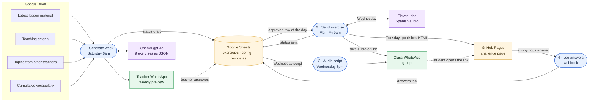

# Daily Exercise Automation · Spanish A1 Course

[Português](README.md) · **English**

> An n8n pipeline that turns each week's lesson into 9 AI-generated exercises, routes them through teacher approval in a spreadsheet, and delivers one exercise per day to the class WhatsApp group, with an interactive quiz, narrated audio and anonymous answer logging.

`n8n` `OpenAI gpt-4o` `Google Sheets` `Google Drive` `WhatsApp (Evolution API)` `ElevenLabs` `GitHub Pages`

---

## The problem

Learning a language takes daily contact, and this community Spanish A1 course meets once a week, for 40 minutes, with groups of 10 to 15 adults. Keeping practice alive between lessons calls for fresh exercises every day, aligned with the character, topic and vocabulary the class has just studied.

## The solution in one sentence

Four n8n workflows generate the week's exercises with AI from the latest lesson, place the teacher as approver at a single control point (the spreadsheet), and publish a different format each weekday to the class WhatsApp group.

| Day | Format | How it reaches students |
|---|---|---|
| Monday | Vocabulary: 5 lesson words in context + own sentence | WhatsApp text |
| Tuesday | Challenge: 5 multiple-choice questions | Link to an interactive web page (GitHub Pages) |
| Wednesday | Listening: 30–40 s audio + 2 questions | ElevenLabs audio on WhatsApp, plus the script as text at 8pm |
| Thursday | Speaking: oral production prompt | WhatsApp text |
| Friday | Reading: short text + open questions | WhatsApp text |

## Architecture

**n8n canvas**

| 1 · Generate week | 2 · Send exercise |
|---|---|
|  |  |
| **3 · Audio script** | **4 · Log answers** |
|  |  |

Node-level diagrams for each workflow, generated from the JSON connections, are in [`docs/diagramas-workflows.md`](docs/diagramas-workflows.md). Node names are kept in Portuguese, as built.

## Workflows and nodes

| # | File | Trigger | What it delivers | Nodes |
|---|---|---|---|---|
| 1 | [`1-gerar-semana.json`](workflows/1-gerar-semana.json) | Schedule · Saturday 6am | Reads from Drive the latest lesson, teaching criteria, topics from other teachers and the cumulative vocabulary; builds the prompt; gpt-4o returns 9 exercises as JSON; a Code node validates the structure and checks the text against the course vocabulary; writes everything to the spreadsheet as `rascunho` (draft) and sends the teacher a WhatsApp preview, with quizzes as native polls. | 15 |
| 2 | [`2-enviar-exercicio.json`](workflows/2-enviar-exercicio.json) | Schedule · Mon–Fri 9am | Reads the `config` tab and today's approved row; a Switch routes by type: **quiz** builds the HTML page, publishes it to GitHub Pages via API, waits 90 s for the build and sends the link; **audio** generates the ElevenLabs narration and sends audio + questions; **text** goes straight out. It then marks the row as `enviado` (sent) with a timestamp. | 16 |
| 3 | [`3-enviar-roteiro-audio.json`](workflows/3-enviar-roteiro-audio.json) | Schedule · Wednesday 8pm | Sends the group the morning audio script, so students can listen again while reading along. | 5 |
| 4 | [`4-registrar-respostas-enquete.json`](workflows/4-registrar-respostas-enquete.json) | Webhook GET | Receives an anonymous call from the challenge page on each answer and logs week, question number, chosen option and correctness to the `respostas` tab. | 3 |

### Design decisions

- **Human in the loop.** AI generates, the teacher approves: delivery picks up only rows with `status = aprovado`. Each exercise's lifecycle is visible in the spreadsheet: `rascunho` → `revisar` → `aprovado` → `enviado`.
- **Spreadsheet as control panel.** The `config` tab holds the destination, WhatsApp instance, ElevenLabs voice and the `ativo` switch, which pauses the whole system from a single cell.
- **Prompt with rules and counter-examples.** The prompt fixes the week's exact structure (9 objects, fixed order), requires a single valid answer per question, distractors drawn from real mistakes of Portuguese speakers, and a check of who is speaking before the answer key is set.
- **Vocabulary control.** A Code node normalizes the generated text, compares it with the course's cumulative vocabulary and sends to `revisar` (review) any exercise that introduces more than 12 new words.
- **Learning data with privacy.** The challenge page logs every answer anonymously, building a per-question, per-week accuracy base that informs the next lesson.
- **Operations.** Retries on read and send nodes, `America/Sao_Paulo` timezone on schedules, and an instance-level error workflow that reports on WhatsApp which workflow and node failed.

### Integrations

| Service | Role in the pipeline | n8n node |
|---|---|---|
| Google Drive | Lesson material, criteria, external topics and vocabulary | HTTP Request with Drive OAuth2 credential |
| OpenAI | Generation of the 9 exercises (gpt-4o, JSON output, temperature 0.7) | OpenAI (LangChain) |
| Google Sheets | Exercises, configuration and answers | Google Sheets |
| WhatsApp | Teacher preview, texts, polls, audio and links | Evolution API (community node) |
| ElevenLabs | Spanish narration (`eleven_multilingual_v2`) | ElevenLabs (community node) |
| GitHub Pages | Hosting for the interactive challenge page | GitHub |

## Results

- In use since August 2026 with a volunteer Spanish A1 class.
- The full week, 9 exercises in 5 formats, is generated in about 30 seconds.
- Teacher curation happens in one weekly moment: reviewing and approving rows in the spreadsheet.
- The first week of the web challenge logged 19 anonymous answers, ready for per-question accuracy analysis.

## How to import

**Requirements:** n8n 2.x (built on self-hosted Community Edition), an instance reachable over HTTPS for the webhook, and the community nodes `n8n-nodes-evolution-api` and `@elevenlabs/n8n-nodes-elevenlabs` installed under *Settings → Community nodes*.

1. Under *Workflows → Import from File*, import the four JSON files from [`workflows/`](workflows/).
2. Create the credentials below and select each one in the matching nodes.
3. Replace the placeholders.
4. Create the spreadsheet with the three tabs described below.
5. Activate workflow 4 first (the webhook must be live), then workflows 1, 2 and 3.

**Credentials**

| Name in JSON | Type | Used in |
|---|---|---|
| Google Drive OAuth2 | Google Drive OAuth2 API | Workflow 1 |
| Google Sheets OAuth2 | Google Sheets OAuth2 API | Workflows 1–4 |
| OpenAI API | OpenAI API | Workflow 1 |
| Evolution API | Evolution API | Workflows 1–3 |
| ElevenLabs API | ElevenLabs API | Workflow 2 |
| GitHub API | GitHub API (token with write access to the Pages repo) | Workflow 2 |

Tip: publish your Google Cloud OAuth app in **Production** mode. The refresh token then stays valid and the Google credentials remain active indefinitely.

**Placeholders**

| Placeholder | Expected value |
|---|---|
| `YOUR_SPREADSHEET_ID` | Google Sheets spreadsheet ID |
| `YOUR_DRIVE_FOLDER_ID` | Drive folder holding the lessons' `.md` files |
| `YOUR_CRITERIA_FILE_ID` · `YOUR_EXTERNAL_TOPICS_FILE_ID` · `YOUR_VOCABULARY_FILE_ID` | Text files on Drive |
| `YOUR_WHATSAPP_NUMBER` · `YOUR_EVOLUTION_INSTANCE` | Number that receives the preview and Evolution API instance |
| `YOUR_N8N_DOMAIN` · `YOUR_WEBHOOK_PATH` | Your n8n domain and workflow 4 webhook path |
| `YOUR_GITHUB_USER` · `YOUR_PAGES_REPO` | GitHub Pages account and repository |

**Spreadsheet**

| Tab | Columns |
|---|---|
| `exercicios` | `id` `semana` `dia` `tipo` `fonte` `enunciado` `guion` `opcao_a` `opcao_b` `opcao_c` `opcao_d` `gabarito` `explicacao` `palabras_nuevas` `status` `enviado_em` |
| `config` | `chave` `valor`, with keys `ativo` (sim/nao), `destino` (group JID), `instancia`, `voice_id` |
| `respostas` | `momento` `semana` `pergunta` `resposta` `acertou` |

---

Part of the [n8n Automation Portfolio](../README.en.md) · Juan Antonio Morales · [LinkedIn](https://www.linkedin.com/in/juanantoniomorales)
