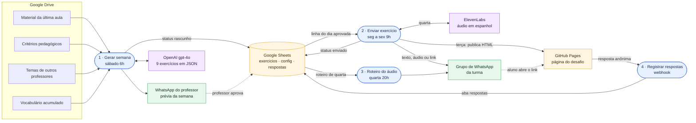
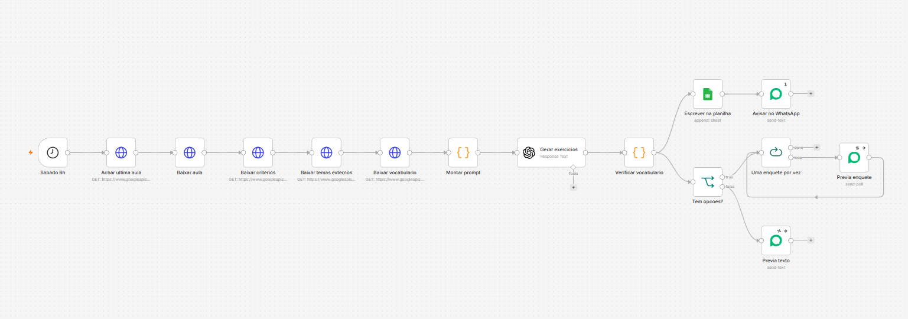
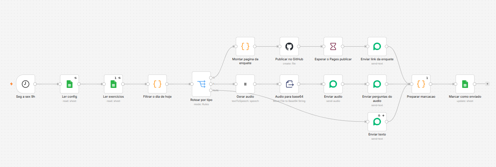
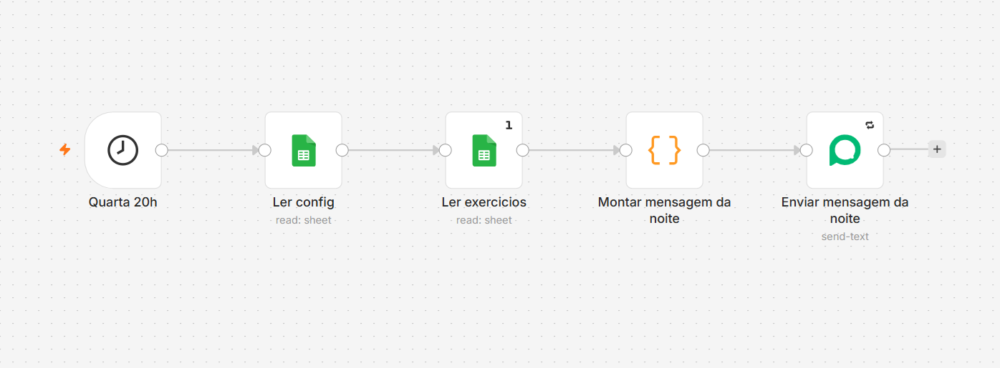
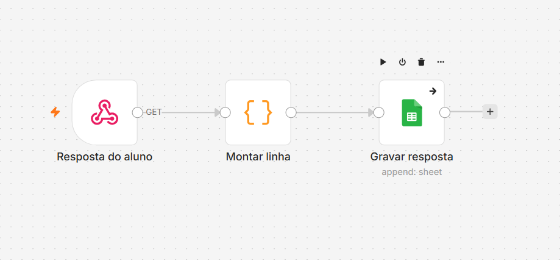

# Automação de exercícios diários · Curso de Espanhol A1

**Português** · [English](README.en.md)

> Pipeline n8n que transforma o material da aula da semana em 9 exercícios gerados por IA, passa pela aprovação do professor em uma planilha e entrega um exercício por dia no grupo de WhatsApp da turma, com enquete interativa, áudio narrado e registro anônimo das respostas.

`n8n` `OpenAI gpt-4o` `Google Sheets` `Google Drive` `WhatsApp (Evolution API)` `ElevenLabs` `GitHub Pages`

---

## O problema

Aprender um idioma pede contato diário, e a aula de um curso popular de espanhol A1 acontece uma vez por semana, em 40 minutos, para turmas de 10 a 15 adultos. Manter a prática viva entre uma aula e outra exige exercícios novos todos os dias, alinhados ao personagem, ao tema e ao vocabulário que a turma acabou de ver.

## A solução em uma frase

Quatro workflows n8n que geram a semana de exercícios com IA a partir da última aula, colocam o professor como aprovador em um único ponto de controle (a planilha) e publicam um formato diferente a cada dia útil no WhatsApp da turma.

| Dia | Formato | Como chega ao aluno |
|---|---|---|
| Segunda | Vocabulário: 5 palavras da aula em contexto + frase própria | Texto no WhatsApp |
| Terça | Desafio: 5 perguntas de múltipla escolha | Link para uma página web interativa (GitHub Pages) |
| Quarta | Escuta: áudio de 30 a 40 s + 2 perguntas | Áudio ElevenLabs no WhatsApp, e às 20h o roteiro em texto |
| Quinta | Fala: proposta de produção oral | Texto no WhatsApp |
| Sexta | Leitura: texto curto + perguntas abertas | Texto no WhatsApp |

## Arquitetura

**Canvas no n8n**

| 1 · Gerar semana | 2 · Enviar exercício |
|---|---|
|  |  |
| **3 · Roteiro do áudio** | **4 · Registrar respostas** |
|  |  |

Os diagramas nó a nó de cada workflow, gerados a partir das conexões do JSON, estão em [`docs/diagramas-workflows.md`](docs/diagramas-workflows.md).

## Workflows e nós

| # | Arquivo | Gatilho | O que entrega | Nós |
|---|---|---|---|---|
| 1 | [`1-gerar-semana.json`](workflows/1-gerar-semana.json) | Schedule · sábado 6h | Lê no Drive a última aula, os critérios pedagógicos, temas de outros professores e o vocabulário acumulado; monta o prompt; o gpt-4o devolve 9 exercícios em JSON; um nó Code valida a estrutura e cruza o texto com o vocabulário do curso; grava tudo na planilha como `rascunho` e manda a prévia ao professor no WhatsApp, com as enquetes como polls nativos. | 15 |
| 2 | [`2-enviar-exercicio.json`](workflows/2-enviar-exercicio.json) | Schedule · seg a sex 9h | Lê a aba `config` e a linha aprovada do dia; um Switch roteia por tipo: **enquete** gera a página HTML, publica no GitHub Pages via API, aguarda 90 s pelo build e envia o link; **áudio** gera a narração na ElevenLabs e envia áudio + perguntas; **texto** segue direto. No fim, marca a linha como `enviado` com data e hora. | 16 |
| 3 | [`3-enviar-roteiro-audio.json`](workflows/3-enviar-roteiro-audio.json) | Schedule · quarta 20h | Envia ao grupo o roteiro do áudio da manhã, para a turma reescutar acompanhando a leitura. | 5 |
| 4 | [`4-registrar-respostas-enquete.json`](workflows/4-registrar-respostas-enquete.json) | Webhook GET | Recebe a chamada anônima da página do desafio a cada resposta e grava semana, número da pergunta, opção escolhida e acerto na aba `respostas`. | 3 |

### Decisões de design

- **Humano no circuito.** A IA gera, o professor aprova: o envio considera apenas linhas com `status = aprovado`. O ciclo de vida de cada exercício fica visível na planilha: `rascunho` → `revisar` → `aprovado` → `enviado`.
- **Planilha como painel de controle.** A aba `config` concentra destino, instância do WhatsApp, voz da ElevenLabs e a chave `ativo`, que pausa todo o sistema com uma célula.
- **Prompt com regras e contraexemplos.** O prompt define a estrutura exata da semana (9 objetos, ordem fixa), exige um único gabarito possível por pergunta, distratores baseados em erros reais de falantes de português e verificação de quem fala na frase antes de fixar a resposta.
- **Controle de vocabulário.** Um nó Code normaliza o texto gerado, compara com o vocabulário acumulado do curso e envia para `revisar` o exercício que traz mais de 12 palavras novas.
- **Dados de aprendizagem com privacidade.** A página do desafio registra cada resposta de forma anônima, o que forma uma base de acertos por pergunta e por semana para orientar a próxima aula.
- **Operação.** Retentativas nos nós de leitura e envio, fuso `America/Sao_Paulo` nos agendamentos e um workflow de erro na instância que avisa no WhatsApp qual fluxo e qual nó falharam.

### Integrações

| Serviço | Uso no pipeline | Nó n8n |
|---|---|---|
| Google Drive | Material da aula, critérios, temas externos e vocabulário | HTTP Request com credencial OAuth2 do Drive |
| OpenAI | Geração dos 9 exercícios (gpt-4o, saída JSON, temperatura 0.7) | OpenAI (LangChain) |
| Google Sheets | Exercícios, configuração e respostas | Google Sheets |
| WhatsApp | Prévia ao professor, textos, polls, áudio e links | Evolution API (community node) |
| ElevenLabs | Narração em espanhol (`eleven_multilingual_v2`) | ElevenLabs (community node) |
| GitHub Pages | Hospedagem da página interativa do desafio | GitHub |

## Resultado

- Em uso desde agosto de 2026 em uma turma voluntária de espanhol A1.
- A semana inteira, 9 exercícios em 5 formatos, é gerada em cerca de 30 segundos.
- A curadoria do professor acontece em um único momento semanal: revisar e aprovar as linhas na planilha.
- A primeira semana de desafio web registrou 19 respostas anônimas, já prontas para análise de acerto por pergunta.

## Como importar

**Requisitos:** n8n 2.x (construído no Community Edition self-hosted), instância acessível por HTTPS para o webhook, e os community nodes `n8n-nodes-evolution-api` e `@elevenlabs/n8n-nodes-elevenlabs` instalados em *Settings → Community nodes*.

1. Em *Workflows → Import from File*, importe os quatro JSON da pasta [`workflows/`](workflows/).
2. Crie as credenciais abaixo e selecione cada uma nos nós correspondentes.
3. Substitua os placeholders.
4. Crie a planilha com as três abas descritas abaixo.
5. Ative o workflow 4 primeiro (o webhook precisa estar no ar) e depois os workflows 1, 2 e 3.

**Credenciais**

| Nome no JSON | Tipo | Onde é usada |
|---|---|---|
| Google Drive OAuth2 | Google Drive OAuth2 API | Workflow 1 |
| Google Sheets OAuth2 | Google Sheets OAuth2 API | Workflows 1 a 4 |
| OpenAI API | OpenAI API | Workflow 1 |
| Evolution API | Evolution API | Workflows 1 a 3 |
| ElevenLabs API | ElevenLabs API | Workflow 2 |
| GitHub API | GitHub API (token com escrita no repositório do Pages) | Workflow 2 |

Dica: publique o app OAuth do Google Cloud em modo **Produção**. Assim o refresh token permanece válido e as credenciais do Google seguem ativas por tempo indeterminado.

**Placeholders**

| Placeholder | Valor esperado |
|---|---|
| `YOUR_SPREADSHEET_ID` | ID da planilha Google Sheets |
| `YOUR_DRIVE_FOLDER_ID` | Pasta do Drive com os arquivos `.md` das aulas |
| `YOUR_CRITERIA_FILE_ID` · `YOUR_EXTERNAL_TOPICS_FILE_ID` · `YOUR_VOCABULARY_FILE_ID` | Arquivos de texto no Drive |
| `YOUR_WHATSAPP_NUMBER` · `YOUR_EVOLUTION_INSTANCE` | Número que recebe a prévia e instância da Evolution API |
| `YOUR_N8N_DOMAIN` · `YOUR_WEBHOOK_PATH` | Domínio da sua instância n8n e path do webhook do workflow 4 |
| `YOUR_GITHUB_USER` · `YOUR_PAGES_REPO` | Conta e repositório do GitHub Pages |

**Planilha**

| Aba | Colunas |
|---|---|
| `exercicios` | `id` `semana` `dia` `tipo` `fonte` `enunciado` `guion` `opcao_a` `opcao_b` `opcao_c` `opcao_d` `gabarito` `explicacao` `palabras_nuevas` `status` `enviado_em` |
| `config` | `chave` `valor`, com as chaves `ativo` (sim/nao), `destino` (JID do grupo), `instancia`, `voice_id` |
| `respostas` | `momento` `semana` `pergunta` `resposta` `acertou` |

---

Parte do [n8n Automation Portfolio](../README.md) · Juan Antonio Morales · [LinkedIn](https://www.linkedin.com/in/juanantoniomorales)
