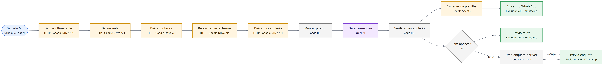
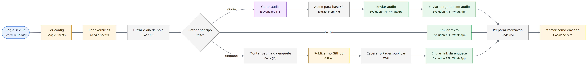
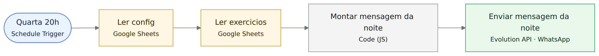
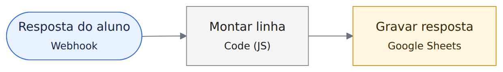

# Diagramas por workflow · Per-workflow diagrams

Gerados a partir do bloco `connections` de cada JSON em `../workflows/` e renderizados com Mermaid. Clique na imagem para ver em tamanho real. Generated from the `connections` block of each JSON in `../workflows/` and rendered with Mermaid. Click an image to view it full size.

Legenda · Legend: azul = gatilho/trigger · roxo = IA/AI · verde = mensageria/messaging · amarelo = dados/data · cinza = lógica/logic. Linhas tracejadas = sub-conexões de IA (modelo, parser) · Dashed = AI sub-connections.

## 1. Gerar semana (sábado 6h)

`workflows/1-gerar-semana.json` · 15 nós/nodes

Fonte · Source: [`diagramas/wf-1-gerar-semana.mmd`](diagramas/wf-1-gerar-semana.mmd)

## 2. Enviar exercicio (seg a sex 9h)

`workflows/2-enviar-exercicio.json` · 16 nós/nodes

Fonte · Source: [`diagramas/wf-2-enviar-exercicio.mmd`](diagramas/wf-2-enviar-exercicio.mmd)

## 3. Enviar roteiro do áudio (quarta 20h)

`workflows/3-enviar-roteiro-audio.json` · 5 nós/nodes

Fonte · Source: [`diagramas/wf-3-enviar-roteiro-audio.mmd`](diagramas/wf-3-enviar-roteiro-audio.mmd)

## 4. Registrar respostas da enquete

`workflows/4-registrar-respostas-enquete.json` · 3 nós/nodes

Fonte · Source: [`diagramas/wf-4-registrar-respostas-enquete.mmd`](diagramas/wf-4-registrar-respostas-enquete.mmd)
