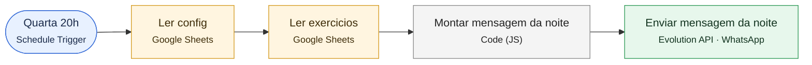
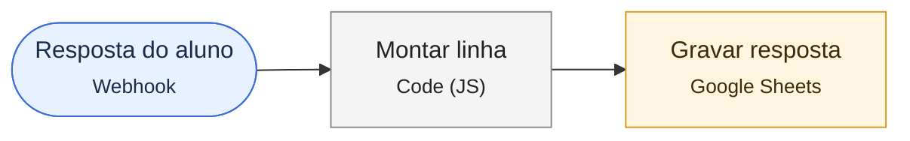

# Diagramas por workflow · Per-workflow diagrams

Gerados automaticamente a partir do bloco `connections` de cada JSON em `../workflows/`. Generated from the `connections` block of each JSON in `../workflows/`.

Legenda · Legend: azul = gatilho/trigger · roxo = IA/AI · verde = mensageria/messaging · amarelo = dados/data · cinza = lógica/logic. Linhas tracejadas = sub-conexões de IA (modelo, parser) · Dashed = AI sub-connections.

## 1. Gerar semana (sábado 6h)

`workflows/1-gerar-semana.json` · 15 nós/nodes

```mermaid
flowchart LR
  n0["Achar ultima aula<br/><small>HTTP · Google Drive API</small>"]:::data
  n1["Baixar aula<br/><small>HTTP · Google Drive API</small>"]:::data
  n2["Baixar criterios<br/><small>HTTP · Google Drive API</small>"]:::data
  n3["Baixar temas externos<br/><small>HTTP · Google Drive API</small>"]:::data
  n4["Baixar vocabulario<br/><small>HTTP · Google Drive API</small>"]:::data
  n5["Montar prompt<br/><small>Code (JS)</small>"]:::logic
  n6["Gerar exercicios<br/><small>OpenAI</small>"]:::ai
  n7["Verificar vocabulario<br/><small>Code (JS)</small>"]:::logic
  n8["Escrever na planilha<br/><small>Google Sheets</small>"]:::data
  n9["Avisar no WhatsApp<br/><small>Evolution API · WhatsApp</small>"]:::msg
  n10{"Tem opcoes?<br/><small>IF</small>"}:::logic
  n11["Previa enquete<br/><small>Evolution API · WhatsApp</small>"]:::msg
  n12["Previa texto<br/><small>Evolution API · WhatsApp</small>"]:::msg
  n13["Uma enquete por vez<br/><small>Loop Over Items</small>"]:::logic
  n14(["Sabado 6h<br/><small>Schedule Trigger</small>"]):::trigger
  n0 --> n1
  n1 --> n2
  n2 --> n3
  n3 --> n4
  n4 --> n5
  n5 --> n6
  n6 --> n7
  n7 --> n8
  n7 --> n10
  n8 --> n9
  n10 -->|true| n13
  n10 -->|false| n12
  n13 -->|loop| n11
  n11 --> n13
  n14 --> n0
  classDef trigger fill:#e8f1ff,stroke:#3b6fd8,color:#1b2b4a
  classDef ai fill:#f3e8ff,stroke:#8a4fd8,color:#2e1a47
  classDef logic fill:#f4f4f4,stroke:#8a8a8a,color:#222
  classDef msg fill:#e7f7ec,stroke:#2f9a57,color:#12331f
  classDef data fill:#fff5e0,stroke:#d49a1f,color:#3d2c08
```

## 2. Enviar exercicio (seg a sex 9h)

`workflows/2-enviar-exercicio.json` · 16 nós/nodes

```mermaid
flowchart LR
  n0["Ler config<br/><small>Google Sheets</small>"]:::data
  n1["Ler exercicios<br/><small>Google Sheets</small>"]:::data
  n2["Filtrar o dia de hoje<br/><small>Code (JS)</small>"]:::logic
  n3{"Rotear por tipo<br/><small>Switch</small>"}:::logic
  n4["Preparar marcacao<br/><small>Code (JS)</small>"]:::logic
  n5["Marcar como enviado<br/><small>Google Sheets</small>"]:::data
  n6["Gerar audio<br/><small>ElevenLabs TTS</small>"]:::ai
  n7["Audio para base64<br/><small>Extract From File</small>"]:::logic
  n8["Enviar audio<br/><small>Evolution API · WhatsApp</small>"]:::msg
  n9["Enviar perguntas do audio<br/><small>Evolution API · WhatsApp</small>"]:::msg
  n10["Enviar texto<br/><small>Evolution API · WhatsApp</small>"]:::msg
  n11(["Seg a sex 9h<br/><small>Schedule Trigger</small>"]):::trigger
  n12["Montar pagina da enquete<br/><small>Code (JS)</small>"]:::logic
  n13["Publicar no GitHub<br/><small>GitHub</small>"]:::data
  n14["Esperar o Pages publicar<br/><small>Wait</small>"]:::logic
  n15["Enviar link da enquete<br/><small>Evolution API · WhatsApp</small>"]:::msg
  n0 --> n1
  n1 --> n2
  n2 --> n3
  n3 -->|enquete| n12
  n3 -->|audio| n6
  n3 -->|texto| n10
  n4 --> n5
  n6 --> n7
  n7 --> n8
  n8 --> n9
  n9 --> n4
  n10 --> n4
  n11 --> n0
  n12 --> n13
  n13 --> n14
  n14 --> n15
  n15 --> n4
  classDef trigger fill:#e8f1ff,stroke:#3b6fd8,color:#1b2b4a
  classDef ai fill:#f3e8ff,stroke:#8a4fd8,color:#2e1a47
  classDef logic fill:#f4f4f4,stroke:#8a8a8a,color:#222
  classDef msg fill:#e7f7ec,stroke:#2f9a57,color:#12331f
  classDef data fill:#fff5e0,stroke:#d49a1f,color:#3d2c08
```

## 3. Enviar roteiro do áudio (quarta 20h)

`workflows/3-enviar-roteiro-audio.json` · 5 nós/nodes

## 4. Registrar respostas da enquete

`workflows/4-registrar-respostas-enquete.json` · 3 nós/nodes

