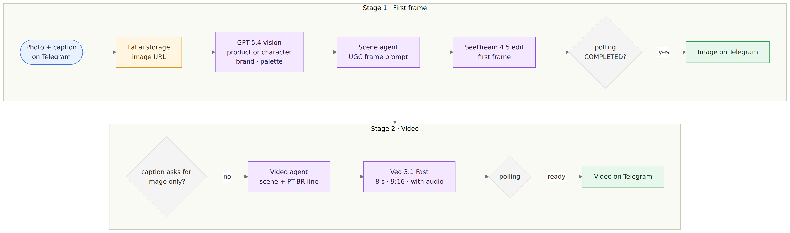
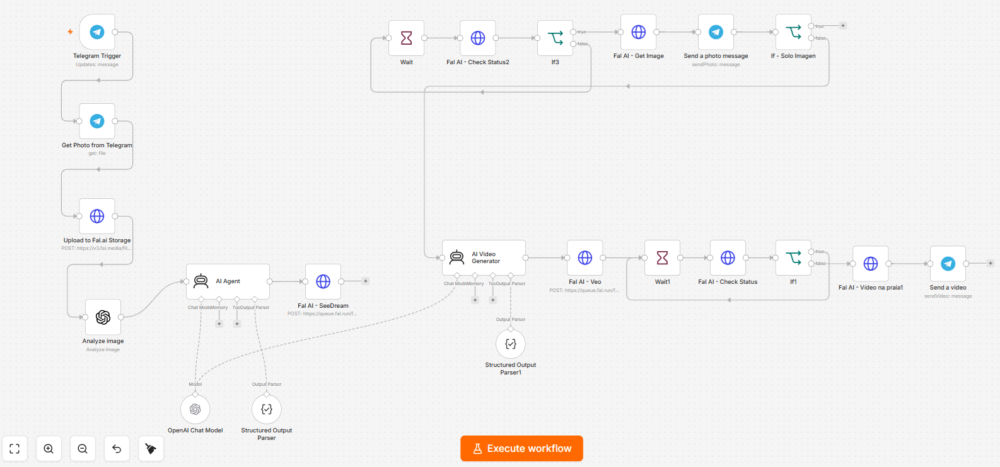

# UGC Video Factory · From a Telegram photo to an AI-made UGC video

[Português](README.md) · **English**

> An n8n workflow that receives a product or character photo on Telegram, builds the scene with AI and returns, in the same chat, an 8-second vertical UGC-style video with a spoken line in Portuguese.

      

---

## The problem

Short UGC-style videos, with someone talking about a product as if filmed on their own phone, are the native format of social media. Each one takes an actor, a set, shooting and editing, which limits how many variations a small brand can test.

## The solution in one sentence

A Telegram bot where the user sends a photo and an instruction in the caption; the workflow analyzes the image, writes the prompts with AI agents, generates the first frame and the video through Fal.ai async queues, and delivers both in the chat.

## Architecture

Editable diagram source: [`docs/diagramas/arquitetura-en.mmd`](docs/diagramas/arquitetura-en.mmd)

**n8n canvas**

The node-level diagram, generated from the JSON connections, is in [`docs/diagramas-workflows.md`](docs/diagramas-workflows.md).

## Stages and nodes

File: [`workflows/ugc-factory-hub.json`](workflows/ugc-factory-hub.json) · 22 nodes

| Stage | Nodes | What happens |
|---|---|---|
| Input | Telegram Trigger → Get Photo from Telegram | Receives the photo and the caption with the user's instruction |
| Hosting | Upload to Fal.ai Storage | Uploads the image and returns the URL the models use |
| Visual analysis | Analyze image (GPT-5.4) | Classifies the image as product, character or both and extracts brand, hex palette, typography and a YAML description |
| Scene prompt | AI Agent + OpenAI Chat Model + Structured Output Parser | Writes the first-frame prompt with UGC aesthetics: phone camera, imperfect light, real setting, packaging text preserved |
| First frame | Fal AI - SeeDream → Wait → Check Status → IF → Get Image | Submits to the SeeDream 4.5 queue (edit from the original photo) and polls every 10 s until `COMPLETED` |
| Image delivery | Send a photo message → If - Solo Imagen | Sends the image to the chat; when the caption asks for "só imagem" (image only), the flow ends here |
| Video prompt | AI Video Generator + Structured Output Parser | Writes the review scene and the actor's line in Brazilian Portuguese |
| Video | Fal AI - Veo → Wait → Check Status → IF → fetch result | Generates an 8 s, 9:16 image-to-video clip with audio on Veo 3.1 Fast and polls the queue until done |
| Video delivery | Send a video | Sends the final video on Telegram |

### Design decisions

- **Async queues with polling.** Image and video generation takes seconds to minutes; the queue → status check → fetch result pattern keeps the workflow stable while it waits.
- **Structured output.** Both agents answer through a Structured Output Parser, and the JSON goes straight into the HTTP request bodies.
- **One shared chat model.** The same `gpt-5.4-mini` serves both agents, which simplifies credentials and cost control.
- **Image-only mode.** A caption keyword generates just the frame, the most economical option when the goal is an image.
- **Prompt guardrails.** Prompts describe well-known characters by their traits, leaving protected names out, and preserve the product's visible text.

### Integrations

| Service | Role | n8n node |
|---|---|---|
| Telegram | Photo input and image/video delivery | Telegram Trigger, Telegram |
| OpenAI | Visual analysis (GPT-5.4) and prompt agents (gpt-5.4-mini) | OpenAI, AI Agent, OpenAI Chat Model |
| Fal.ai | Storage, SeeDream 4.5 edit and Veo 3.1 Fast image-to-video | HTTP Request with Header Auth |

## Results

- From photo to video in a single chat: 1 reference image + 1 caption produce a UGC frame and an 8 s vertical video with audio.
- Built as a hands-on project during AI automation training, applying multimodal orchestration, agents with structured output and async API integration.

## How to import

**Requirements:** n8n 2.x (built on self-hosted Community Edition) and an instance reachable over HTTPS, which the Telegram Trigger uses to register the bot webhook.

1. Under *Workflows → Import from File*, import [`workflows/ugc-factory-hub.json`](workflows/ugc-factory-hub.json).
2. Create the credentials below and select each one in the matching nodes.
3. Activate the workflow and send a photo with a caption to your bot.

| Name in JSON | Type | Setup |
|---|---|---|
| Telegram Bot API | Telegram API | Bot token from @BotFather |
| OpenAI API | OpenAI API | OpenAI API key |
| Fal.ai API Key (Header Auth) | Header Auth | Name: `Authorization` · Value: `Key <your-fal-key>` |

Production tip: add an IF right after the Telegram Trigger that allows only authorized chat IDs. Every video consumes Fal.ai credits.

---

Part of the [n8n Automation Portfolio](../README.en.md) · Juan Antonio Morales, Data Project Manager · [LinkedIn](https://www.linkedin.com/in/juanantoniomorales) · License [MIT](../LICENSE)
