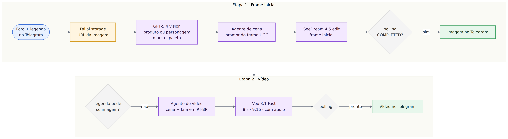

# UGC Video Factory · De uma foto no Telegram a um vídeo UGC com IA

**Português** · [English](README.en.md)

> Workflow n8n que recebe a foto de um produto ou personagem no Telegram, cria a cena com IA e devolve no mesmo chat um vídeo vertical de 8 segundos no estilo UGC, com fala em português.

      

---

## O problema

Vídeos curtos no estilo UGC, com alguém falando do produto como se tivesse filmado no próprio celular, são o formato natural das redes sociais. Produzir cada um pede ator, cenário, gravação e edição, e isso limita quantas variações uma marca pequena consegue testar.

## A solução em uma frase

Um bot de Telegram em que a pessoa envia a foto e uma instrução na legenda; o workflow analisa a imagem, escreve os prompts com agentes de IA, gera o frame inicial e o vídeo em filas assíncronas do Fal.ai e entrega imagem e vídeo no chat.

## Arquitetura

Fonte editável do diagrama: [`docs/diagramas/arquitetura-pt.mmd`](docs/diagramas/arquitetura-pt.mmd)

**Canvas no n8n**

O diagrama nó a nó, gerado a partir das conexões do JSON, está em [`docs/diagramas-workflows.md`](docs/diagramas-workflows.md).

## Etapas e nós

Arquivo: [`workflows/ugc-factory-hub.json`](workflows/ugc-factory-hub.json) · 22 nós

| Etapa | Nós | O que acontece |
|---|---|---|
| Entrada | Telegram Trigger → Get Photo from Telegram | Recebe a foto e a legenda com a instrução do usuário |
| Hospedagem | Upload to Fal.ai Storage | Sobe a imagem e gera a URL usada pelos modelos |
| Análise visual | Analyze image (GPT-5.4) | Classifica a imagem como produto, personagem ou ambos e extrai marca, paleta em hex, tipografia e descrição em YAML |
| Prompt da cena | AI Agent + OpenAI Chat Model + Structured Output Parser | Escreve o prompt do frame inicial com estética UGC: câmera de celular, luz imperfeita, cenário real e o texto da embalagem preservado |
| Frame inicial | Fal AI - SeeDream → Wait → Check Status → IF → Get Image | Envia para a fila do SeeDream 4.5 (edição a partir da foto original) e consulta o status a cada 10 s até `COMPLETED` |
| Entrega da imagem | Send a photo message → If - Solo Imagen | Envia a imagem no chat; quando a legenda pede "só imagem", o fluxo termina aqui |
| Prompt do vídeo | AI Video Generator + Structured Output Parser | Escreve a cena do review e a fala do ator em português do Brasil |
| Vídeo | Fal AI - Veo → Wait → Check Status → IF → busca do resultado | Gera no Veo 3.1 Fast um vídeo image-to-video de 8 s, 9:16, com áudio, e consulta a fila até concluir |
| Entrega do vídeo | Send a video | Envia o vídeo final no Telegram |

### Decisões de design

- **Filas assíncronas com polling.** Geração de imagem e vídeo leva de segundos a minutos; o padrão fila → consulta de status → busca do resultado mantém o workflow estável durante a espera.
- **Saída estruturada.** Os dois agentes respondem por meio de Structured Output Parser, e o JSON entra direto no corpo das chamadas HTTP.
- **Um modelo de chat compartilhado.** O mesmo `gpt-5.4-mini` atende os dois agentes, o que simplifica credencial e controle de custo.
- **Modo "só imagem".** A palavra-chave na legenda gera apenas o frame, a opção mais econômica quando o objetivo é uma imagem.
- **Guardrails no prompt.** Os prompts descrevem personagens conhecidos pelas suas características, sem nomes protegidos, e preservam o texto visível do produto.

### Integrações

| Serviço | Uso | Nó n8n |
|---|---|---|
| Telegram | Entrada da foto e entrega da imagem e do vídeo | Telegram Trigger, Telegram |
| OpenAI | Análise visual (GPT-5.4) e agentes de prompt (gpt-5.4-mini) | OpenAI, AI Agent, OpenAI Chat Model |
| Fal.ai | Storage, SeeDream 4.5 edit e Veo 3.1 Fast image-to-video | HTTP Request com Header Auth |

## Resultado

- Da foto ao vídeo em um único chat: 1 imagem de referência + 1 legenda resultam em um frame UGC e em um vídeo vertical de 8 s com áudio.
- Construído como projeto prático de formação em automação com IA, aplicando orquestração multimodal, agentes com saída estruturada e integração com APIs assíncronas.

## Como importar

**Requisitos:** n8n 2.x (construído no Community Edition self-hosted) e instância acessível por HTTPS, que o Telegram Trigger usa para registrar o webhook do bot.

1. Em *Workflows → Import from File*, importe [`workflows/ugc-factory-hub.json`](workflows/ugc-factory-hub.json).
2. Crie as credenciais abaixo e selecione cada uma nos nós correspondentes.
3. Ative o workflow e envie uma foto com legenda para o seu bot.

| Nome no JSON | Tipo | Configuração |
|---|---|---|
| Telegram Bot API | Telegram API | Token do bot criado no @BotFather |
| OpenAI API | OpenAI API | Chave da API OpenAI |
| Fal.ai API Key (Header Auth) | Header Auth | Name: `Authorization` · Value: `Key <sua-chave-fal>` |

Dica para produção: adicione um IF logo após o Telegram Trigger liberando apenas os chat IDs autorizados. Cada vídeo consome créditos do Fal.ai.

---

Parte do [n8n Automation Portfolio](../README.md) · Juan Antonio Morales · [LinkedIn](https://www.linkedin.com/in/juanantoniomorales) · Licença [MIT](../LICENSE)
