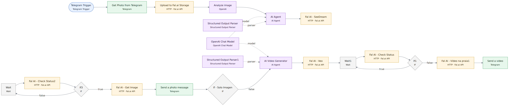

# Diagramas por workflow · Per-workflow diagrams

Gerados a partir do bloco `connections` de cada JSON em `../workflows/` e renderizados com Mermaid. Clique na imagem para ver em tamanho real. Generated from the `connections` block of each JSON in `../workflows/` and rendered with Mermaid. Click an image to view it full size.

Legenda · Legend: azul = gatilho/trigger · roxo = IA/AI · verde = mensageria/messaging · amarelo = dados/data · cinza = lógica/logic. Linhas tracejadas = sub-conexões de IA (modelo, parser) · Dashed = AI sub-connections.

## UGC Factory HUB

`workflows/ugc-factory-hub.json` · 22 nós/nodes

Fonte · Source: [`diagramas/wf-ugc-factory-hub.mmd`](diagramas/wf-ugc-factory-hub.mmd)
